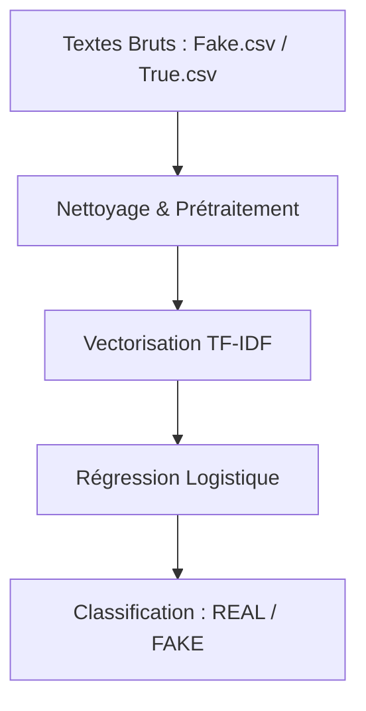

# AntiFake - Détection Automatique de Fake News par Machine Learning

## 🛠️ Compétences Démontrées (Skills)
* **Traitement du Langage Naturel (NLP)** : Nettoyage et normalisation de texte (expressions régulières), extraction de caractéristiques fréquentielles via [TF-IDF](https://scikit-learn.org/stable/modules/generated/sklearn.feature_extraction.text.TfidfVectorizer.html).
* **Machine Learning** : Classification binaire supervisée, entraînement et évaluation de [Régression Logistique](https://scikit-learn.org/stable/modules/generated/sklearn.linear_model.LogisticRegression.html), analyse de rapports de performance (Précision, Rappel, F1-Score, Exactitude).
* **Ingénierie MLOps de base** : Sauvegarde et chargement d'artifacts de modèles (`joblib`), création de scripts d'inférence interactifs.
* **Audit et Esprit Critique (ML Auditing)** : Détection de biais de jeux de données (*shortcut learning*), identification d'anomalies de code et proposition de correctifs.

---

Ce projet propose une implémentation classique de classification de texte pour distinguer les articles de presse réels (*REAL*) des fausses informations (*FAKE*). Il utilise une approche basée sur l'extraction de caractéristiques fréquentielles (**TF-IDF**) associée à un classifieur linéaire (**Régression Logistique**).

## 🔬 Architecture Technique & Pipeline

Le projet est structuré autour d'un pipeline d'apprentissage automatique supervisé comprenant trois étapes clés :



1. **Prétraitement du texte (`clean_text`)** :
   - Passage en minuscules.
   - Suppression des balises HTML.
   - Suppression des URL et liens web.
   - Retrait de la ponctuation et des caractères non-alphanumériques.
   - Suppression des sauts de ligne.

2. **Représentation Vectorielle (TF-IDF)** :
   - Transformation du texte nettoyé en vecteurs numériques via un `TfidfVectorizer`. Cette méthode évalue l'importance relative de chaque mot en mesurant sa fréquence locale (TF) pondérée par sa rareté globale dans l'ensemble du corpus (IDF).

3. **Classification (Régression Logistique)** :
   - Un modèle de régression logistique binaire estime la probabilité qu'un article appartienne à la classe `REAL` (1) ou `FAKE` (0) à partir des poids attribués à chaque n-gramme/mot du vocabulaire appris.

---

## ⚠️ Analyse Critique & Limites (Ne pas Survendre)

Bien que le modèle affiche des métriques d'évaluation exceptionnelles lors des tests (score d'exactitude ou **accuracy de ~98.6%**), une analyse rigoureuse révèle plusieurs limites structurelles majeures qu'il convient de ne pas ignorer.

### 1. Le Piège du "Shortcut Learning" (Biais de Dataset)
L'exactitude presque parfaite (~99%) observée sur ce type de dataset (comme le jeu de données public *ISOT Fake News Dataset*) n'indique pas que l'algorithme "comprend" la vérité. Il s'agit d'un cas classique d'apprentissage de raccourcis :
- **Signature Reuters** : La quasi-totalité des articles du fichier `True.csv` proviennent de l'agence Reuters et commencent par l'en-tête de dépêche caractéristique `"WASHINGTON (Reuters) - [...]"`. Le modèle identifie instantanément le mot **"reuters"** comme un prédicteur absolu de la classe `REAL`.
- **Style éditorial** : Les articles du fichier `Fake.csv` proviennent de blogs ou de sources d'opinion et comportent souvent des titres en majuscules ou un vocabulaire plus sensationnaliste. Le modèle apprend ce style d'écriture plutôt que la véracité des faits.
- **Résultat** : Soumis à un article moderne, neutre, mais factuellement faux (ou inversement à un article réel sans la mention Reuters), le modèle perd une grande partie de sa fiabilité opérationnelle.

### 2. Absence de Vérification Factuelle (Fact-Checking)
Ce modèle est un **classifieur lexical et stylistique**, pas un moteur de vérité.
- Il n'a aucun accès à une base de connaissances externe (comme Wikipedia, Wikidata ou le web).
- Si vous lui soumettez une phrase factuellement fausse écrite dans un style journalistique parfait (ex: *"Le premier ministre français a déclaré la guerre à l'océan en 2026"*), le modèle la classifiera très probablement comme **REAL** car la syntaxe et le vocabulaire correspondent aux motifs des articles réels appris.

### 3. Limite Linguistique et Temporelle
- Le modèle actuel est entraîné exclusivement sur un corpus d'articles rédigés en **anglais**. Il est incapable de traiter des textes en français sans un réentraînement complet sur un dataset francophone approprié.
- Les données d'entraînement datent principalement de la période **2016-2017** (centrées sur la politique américaine). Le vocabulaire politique et les entités nommées de cette époque sur-représentent certains termes qui n'ont plus la même pertinence aujourd'hui.

---

## 🛠️ Audit de Code & Améliorations Requises

En tant qu'experts, nous identifions deux anomalies techniques notables dans le code actuel :

### 1. Le Bug de l'expression régulière dans `clean_text`
Dans `src/traitement.ipynb` et `notebooks/app.py`, la fonction de nettoyage contient la ligne suivante :
```python
text = re.sub("/w*/d/w*", "", text)
```
* **Problème** : L'utilisation de slashs normaux `/` au lieu de backslashs `\` rend cette expression régulière inopérante. Au lieu de cibler les mots contenant des chiffres (`\w*\d\w*`), elle recherche littéralement la chaîne de caractères `/w*/d/w*`.
* **Correction recommandée** :
  ```python
  text = re.sub(r"\w*\d\w*", "", text)
  ```

### 2. Portabilité des modèles (Chemins d'accès absolus)
Le script de test interactif (`app.py`) charge les artifacts avec des chemins absolus spécifiques à une machine locale :
```python
vectoriser = joblib.load("C:\\Downloads\\fake-news\\models\\Vec.jb")
model = joblib.load("C:\\Downloads\\fake-news\\models\\Model.jb")
```
* **Problème** : Cela empêche l'exécution immédiate du projet sur une autre machine sans modifier le code.
* **Correction recommandée** : Utiliser des chemins d'accès relatifs par rapport à la racine du projet :
  ```python
  import os
  base_dir = os.path.dirname(os.path.dirname(os.path.abspath(__file__)))
  vectoriser = joblib.load(os.path.join(base_dir, "models", "Vec.jb"))
  model = joblib.load(os.path.join(base_dir, "models", "Model.jb"))
  ```

---

## 📁 Structure du Dépôt

```text
AntiFake/
├── data/                  # Fichiers bruts Fake.csv et True.csv (non suivis par Git si volumineux)
├── models/                # Sauvegardes sérialisées du vectoriseur (Vec.jb) et du modèle (Model.jb)
├── notebooks/
│   ├── app.ipynb          # Notebook de test interactif
│   └── app.py             # Script Python d'inférence en ligne de commande
├── src/
│   └── traitement.ipynb   # Pipeline d'exploration, de nettoyage et d'entraînement du modèle
├── requirements.txt       # Dépendances logicielles du projet
└── README.md              # Documentation du projet
```

---

## 🚀 Installation & Utilisation

### Prérequis
Assurez-vous d'avoir Python 3.8+ installé. Installez ensuite les bibliothèques requises :
```bash
pip install -r requirements.txt
```

### Entraînement du modèle
Pour réentraîner le modèle et régénérer les fichiers sérialisés dans `models/` :
1. Placez les fichiers `Fake.csv` et `True.csv` dans le dossier racine ou dans le sous-dossier adéquat.
2. Exécutez toutes les cellules du notebook [traitement.ipynb](file:///c:/Users/User/AntiFake/src/traitement.ipynb).

### Test interactif (Inférence)
Pour tester des articles à la main, exécutez le script interactif :
```bash
python notebooks/app.py
```
*Note: Avant de lancer ce script, veillez à corriger les chemins absolus mentionnés dans la section Audit.*
